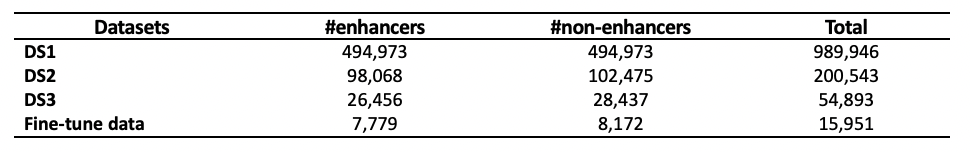
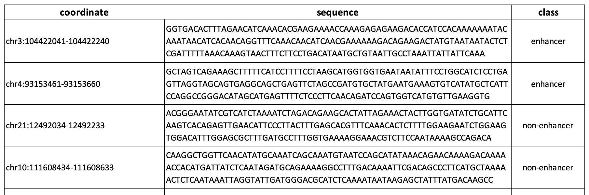
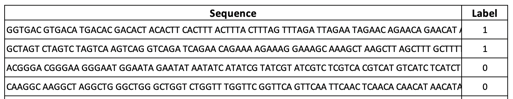

# DNABERT-Enhancer: Harnessing the Power of a Comprehensive ENCODE-Guided Dataset for Enhancer Prediction

## Overview
DNABERT-Enhancer is a cutting-edge computational tool designed for the identification of enhancers – crucial regulatory elements in genomics. This repository hosts the DNABERT-Enhancer model, datasets, and related resources.

## Table of Contents
- [Introduction](#introduction)
- [Abstract](#abstract)
- [Datasets](#datasets)
- [Model and Usage](#model)
  - [Data Processing](#data-processing)
  - [Usage](#usage)
    - [Download Fine-tuned Model](#download-fine-tuned-model)
    - [Getting Prediction from the Model](#getting-prediction-from-the-model)
    - [Storing the Results in W&B](#storing-the-results-in-wb)
- [Usage](#usage)
- [Citation](#citation)
- [Contact](#contact)

## Introduction
Enhancers play a pivotal role in gene expression and can be linked to various diseases when they malfunction. Identifying these enhancers is a significant challenge in computational biology due to their variable characteristics and lack of distinct genomic features.

## Abstract
This project presents a comprehensive approach to enhancer prediction by combining 10 public datasets and constructing a feature matrix using ENCODE ChIP-Seq peak regions. Through a series of steps involving Random Forest classifiers and iterative refinement, we've created a high-quality dataset and developed the DNABERT-Enhancer model. This model, fine-tuned on this dataset, showcases an accuracy of 80.92% in enhancer prediction, demonstrating its effectiveness.

## Datasets
For building the **DNABERT-Enhancer** model, we created enhancer and non-enhancer data, length of 200 bp, using 10 different databases and eliminated potential mislabeled sequences by applying a Random Forest classifier iteratively. 

### Data statistics
In the whole process of preparing unbiased and reliable data (_Fine-tune data_) for DNABERT finetuning task, we prepared 3 datasets namely _dataset 1(DS1)_, _dataset 2(DS2)_ and dataset _3(DS3)_ where DS2 and DS3 are subsets of DS1, created by selecting the true predictions (True positives and True negatives) by the Random Forest models. The statistics of the four datasets are given in below table. 

### Data structure
Each dataset is a feature matrix which represents the intersect between the enhancer/non-enhancer regions with 4000 ENCODE ChIP-seq features, where the values represent the number of overlapped peaks. The rows are the enhancer/non-enhancer elements and columns are the ENCODE ChIP-seq peaks or features. Matrix structure is as shown in the below figure.

### Sample dataset
<!--The repository includes the combined dataset of enhancer and non-enhancer sequences used for training and testing the DNABERT-Enhancer model. -->
A sample dataset of 500 enhancers and 500 non-enhancers (1000 entries) from the _Fine-tune data_ is provided in the 'Sample_dataset' folder. The ‘Sample_Fine-tune_data_entries.csv’ has the sampled enhancer and non-enhancer coordinates with sequence and class name. The ‘Sample_DNABERT_input.tsv’ has the hexamers and the label of the corresponding sampled entries. Please refer to below figures for the format of the files.



**Note**: The entire dataset will be available upon request.

## Model
DNABERT-Enhancer is built upon [DNABERT](https://github.com/jerryji1993/DNABERT), a large language model for the human genome, fine-tuned specifically for enhancer prediction.

### Data Processing
Explain the data processing steps involved in preparing the dataset for the model.

### Usage
Instructions on how to effectively use the DNABERT-Enhancer model.


#### Download Fine-tuned Model
Instructions on how to download the DNABERT-Enhancer model from Hugging Face.

#### Getting Prediction from the Model
Guidelines on how to use the DNABERT-Enhancer model to make predictions.

#### Storing the Results in W&B
Steps to log and track model predictions using Weights and biases.

### Model Highlights:
- **Test Accuracy:** 80.92%
- **Features:** Top ENCODE features
- **Methodology:** Random Forest classifiers and iterative refinement

## Usage
Instructions on how to use the DNABERT-Enhancer model and datasets for enhancer prediction will be provided here.

## Citation
If you use the DNABERT-Enhancer in your research, please cite our paper:

```bib

@article{ji2021dnabert,
    author = {Ji, Yanrong and Zhou, Zhihan and Liu, Han and Davuluri, Ramana V},
    title = "{DNABERT: pre-trained Bidirectional Encoder Representations from Transformers model for DNA-language in genome}",
    journal = {Bioinformatics},
    volume = {37},
    number = {15},
    pages = {2112-2120},
    year = {2021},
    month = {02},
    issn = {1367-4803},
    doi = {10.1093/bioinformatics/btab083},
    url = {https://doi.org/10.1093/bioinformatics/btab083},
    eprint = {https://academic.oup.com/bioinformatics/article-pdf/37/15/2112/50578892/btab083.pdf},
}


@misc{zhou2023dnabert2,
      title={DNABERT-2: Efficient Foundation Model and Benchmark For Multi-Species Genome}, 
      author={Zhihan Zhou and Yanrong Ji and Weijian Li and Pratik Dutta and Ramana Davuluri and Han Liu},
      year={2023},
      eprint={2306.15006},
      archivePrefix={arXiv},
      primaryClass={q-bio.GN}
}
